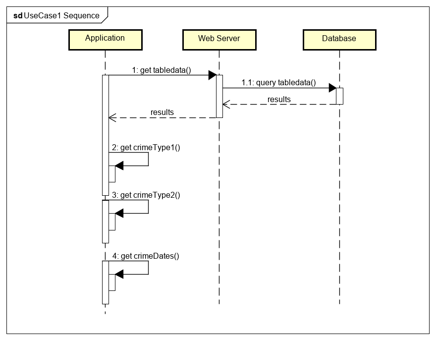
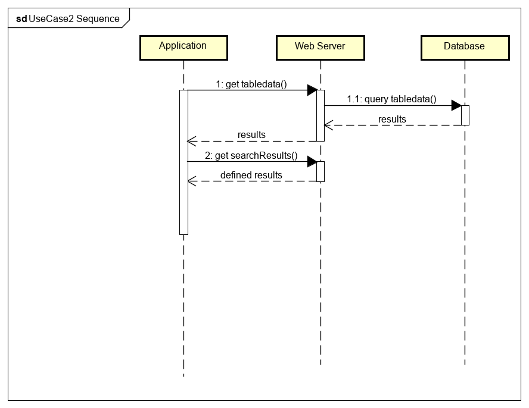
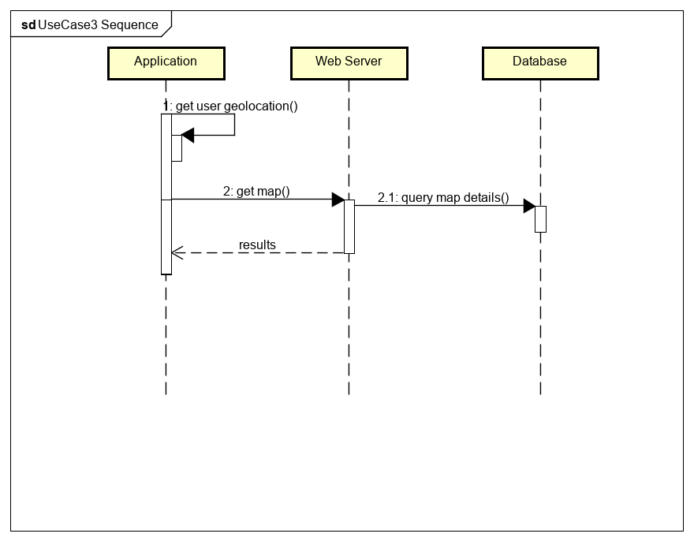

# Design

## Behavioural design
UC1
1.Request full table of information selecting "table page"
2.Get all ward information (statistics/dates)
3.Request certain crime types/ dates from coded buttons
4.Get certain crime types/dates from specific coded buttons
5.Get table results of step 4
6.View table of defined search terms

UC2
1.Request full table of information selecting "table page"
2.Get all ward information (statistics/dates)
3.Request table details matching search for specified Ward Name
4.Get table results of step3
4.View table of defined search terms

UC3
1.Request map by selecting map page
2.Request Permission to access user location
3.Give permission for geo-location (on request)
4.Get map displaying wards and annotated statistics
5.View map displaying wards and statistics

## User Interface design

