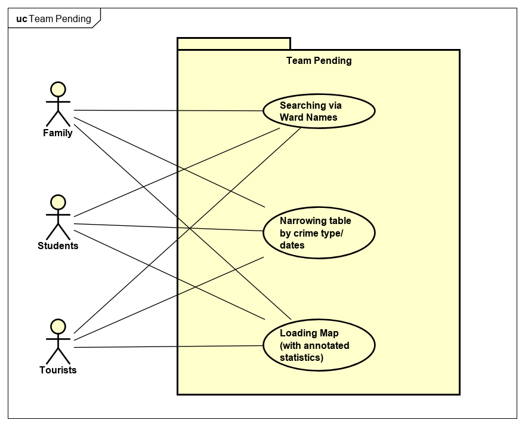

# Requirements

## User Needs

### User stories
  * As a family I want to move to be able to check an areas' burglary rate so that I know it is a safe area for my children and our possessions.

  * As a tourist I want to check popular areas of the city so that I know they are safe to visit.

  * As a student/ younger individual I want to compare crime statistics to accomodation so that I know where I am living while studying is safe.

Actors
Families
Tourists
Students/ Younger Generation 

### Use Cases

| UC1 | Table Buttons - Alex | 
| -------------------------------------- | ------------------- |
Goal to be achieved by use case and sources for requirements:
The goal of this feature is to allow the user to be able to easily find out what areas are most dangerous around Bristol. This is done by utilising the three buttons to identify different types of threats and how recent they were. The buttons are meant to be intuitive over what information they will display, and accessible in the page layout.

List of actors to be involved in use case:
Families
Students
Tourists

Pre/post conditions if any:
User must be on the table page of the website

Interactions between actors and systems necessary to achieve goal:
- User clicks on one of the options on the top of the table to switch the information between “time period” , “number of burglaries” and, “number of violent and sexual offences”

- the system will then access the database and display the information relevant to the heading clicked along with the ward code and name. 

- user can then read the information given or click on another option.

Any variants in the steps of the use case:
- More options of information available to give a wider range of knowledge to the user

- Link the table results with the search bar to return a filtered list of results allowing the user to be more precise in the areas they look over

|  UC2 | Search Function - Ben | 
| -------------------------------------- | ------------------- |
Description:
The premise of this use case is to be able to search via ward name to display crime statistics in chosen ward, this can aid people wishing to look at aspecific location as opposed to being presented with mass amounts of information.

Actors:
Families
Students
Tourists

AssumptionsL
Must be on the table page to see and use the search bar.

Steps:
- User selects the table page, which will display the entirety of wards, time periods, and statistics,

- The user can enter a Ward Name into a search bar located to the top right of the page (e.g. "Ashley") for it to display all wards that contain the word "Ashley" along with their crime statistics and time period.

| TODO: USE-CASE ID e.g. UC3 | Map - Jamie | 
| -------------------------------------- | ------------------- |
| **Description** | TODO: Goal to be achieved by use case and sources for requirement |
| **Actors** | TODO: List of actors involved in use case |
| **Assumptions** | TODO: Pre/post-conditions if any</td></tr>
| **Steps** | TODO: Interactions between actors and system necessary to achieve goal |
| **Variations** | TODO: OPTIONAL - Any variations in the steps of a use case |
| **Non-functional** | TODO: OPTIONAL - List of non-functional requirements that the use case must meet. |
| **Issues** | TODO: OPTIONAL - List of issues that remain to be resolved |

## Software Requirements Specification
### Functional requirements
FR1 - The system must get ward names from database. (UC1, UC2)

FR2 - The system must get crime statistics from database. (UC1, UC2)

FR3 - The system must display a map of all wards in Bristol. (UC3)

FR4 - The system should enable searching of ward names from the table (UC2)

FR5 - The system could narrow down the table into crimes/ date & time (UC1)

FR6 - The system could get user geo-location from navigator.geolocation. (UC3)

FR7 - The system won't show routes on map. (UC3)

### Non-Functional Requirements
NFR1 - Maintainability - Full source code availble on GitHub.

NFR2 - Efficiency - Should load web pages within 2 seconds.

NFR3 - Portability - Should work in the Chrome browser

NFR4 - Portability - Should work in ther browsers, however geolocation functionality will be lost.

NFR5 - Reliability - Should keep up to date when new data is added.

NFR6 - Functionality - No passwords required, all data is open source.

NFR7 - Usability - Should be presented in a standard layout across all pages.
